# my_devops_project_2


***
## 1. Инструмент ipcalc

- Поднята виртуальная машина с названием - ws1.
- Установить ipcalc на ws1 с помощью команды `sudo apt install ipcalc`


- Ввести команду в ws1 `ipcalc 192.167.38.54/13`


По рисунку можно определить:
Адрес сети - 192.160.0.0

### 1.1 Сети и маски

Для того, чтобы определить маску 255.255.255.0 в префиксном и двоичном виде, необходимо еще раз выполнить предыдущую команду, но без явного указания маски подсети. Ниже представлен вывод команды `ipcalc 192.167.38.54`


По рисунку
- Маска 255.255.255.0 в префиксном виде - 24;
- Маска 255.255.255.0 в двоичном виде - 11111111.11111111.11111111.00000000.

Для того, чтобы определить маску /15 в обычном и двоичном виде, необходимо еще раз выполнить предыдущую команду, но с явным указанием маски подсети. Ниже представлен вывод команды `ipcalc 192.167.38.54/15`


- Маска /15 в обычном виде - 255.254.0.0;
- маска /15 в двоичном виде - 11111111.1111111 0.00000000.00000000.

Для того, чтобы определить маску 11111111.11111111.11111111.11110000 в обычном виде, необходимо посчитать количество единиц. Префиксная форма определяется выполнением команды `ipclac 192.167.38.54/28`


- Маска 11111111.11111111.11111111.11110000 в обычном виде - 28;
- Маска 11111111.11111111.11111111.11110000 в префиксном виде - 255.255.255.240.

Для того, чтобы определить минимальный и максимальный хосты в сети 12.167.38.4 при масках: /8, 11111111.11111111.00000000.00000000, 255.255.254.0 и /4, необходимо представить маску в десятичном виде. Т.к. /8 уже представлена в десятичном виде, можно выполнить команду `ipcalc 12.167.38.4/8` и определить хосты.


- Минимальный хост в сети 12.167.38.4/8 - 12.0.0.1;
- Максимальный хост в сети 12.167.38.4/8 - 12.255.255.254.

Для перевода маску 11111111.11111111.00000000.00000000 в обычный вид нужно посчитать количество единиц. После этого можно выполнить команду `ipcalc 12.167.38.4/16`


- Минимальный хост в сети 12.167.38.4/16 - 12.167.0.1;
- Максимальный хост в сети 12.167.38.4/16 - 12.167.255.254.

Для определения следующих хостов нужно выполнить команду `ipcalc 12.167.38.4/255.255.254.0`


- Минимальный хост в сети 12.167.38.4/255.255.254.0 - 12.167.38.1;
- Максимальный хост в сети 12.167.38.4/255.255.254.0 - 12.167.39.254.

Для определения следующих хостов нужно выполнить команду `ipcalc 12.167.38.4/4`


- Минимальный хост в сети 12.167.38.4/4 - 0.0.0.1;
- Максимальный хост в сети 12.167.38.4/4 - 15.255.255.254.

### 1.2 localhost

> __Localhost__ - это стандартное сетевое имя, которое используется для ссылки на локальный компьютер или локальный сервер в сети. Он обычно связан с IP-адресом 127.0.0.1, что означает, что он указывает на собственный сетевой интерфейс устройства.
> Localhost используется для обращения к веб-серверу, работающему на том же компьютере или сервере, на котором запущен браузер. Когда вы вводите "localhost" в адресной строке браузера, он перенаправляет запросы к серверу, работающему на вашем собственном компьютере.
> Localhost часто используется во время разработки веб-сайтов или веб-приложений. Вы можете запустить локальный веб-сервер на своем компьютере и просматривать сайт или тестировать приложение, необходимое вам без необходимости размещения его на удаленном сервере. Это удобно для отладки и разработки, поскольку вы можете вносить изменения и тестировать их мгновенно на своем локальном компьютере.
> Кроме того, localhost также используется для обращения к другим локальным службам, работающим на вашем компьютере, таким как базы данных или другие серверные приложения. Вы можете настроить эти службы на отклик на запросы, отправленные на localhost, чтобы обрабатывать данные или предоставлять другие функциональные возможности вашей локальной системы. Localhost имеет диапазон ip-адресов 127.0.0.1 — 127.255.255.254.
> Таким образом, localhost со следующими ip адресами может существовать: 127.0.0.2, 127.1.0.1, а с такими нет - 194.34.23.100, 128.0.0.1.

### 1.3. Диапазоны и сегменты сетей

- Частный IP-адрес существует в определенных диапазонах частных IP-адресов, зарезервированных Управлением по присвоению номеров в Интернете (IANA), и никогда не должен появляться в Интернете. Частные IP-адреса могут быть в следующих диапазонах:
  - Класс А: 10.0.0.0 – 10.255.255.255;
  - Класс B: 172.16.0.0 – 172.31.255.255;
  - Класс С: 192.168.0.0 – 192.168.255.255.
- Публичные IP-адреса могут быть в следующих диапазонах:
  - Класс A: 1.0.0.0 - 9.255.255.255, 11.0.0.0 - 126.255.255.255;
  - Класс В: 128.0.0.0 - 172.15.255.255, 172.32.0.0 - 191.255.255.255;
  - Класс С: 192.0.0.0 - 192.167.255.255, 192.169.0.0 - 223.255.255.255;
  - Класс D: 224.0.0.0 - 247.255.255.255.
  - Класс E: 248.0.0.0 - 255.255.255.254.
- Теперь расскажу о том, где используются данные классы:
  - Класс A: Адреса класса A предназначены для крупных сетей, таких как провайдеры интернета. Они используются для идентификации сетей, и их первый октет (от 1 до 126) определяет сеть, а остальные три октета - узлы в этой сети.
  - Класс B: Адреса класса B используются для средних сетей. Первые два октета (от 128 до 191) определяют сеть, а два последних октета - узлы в сети.
  - Класс C: Адреса класса C предназначены для небольших сетей. Первые три октета (от 192 до 223) определяют сеть, а последний октет - узлы в сети.
  - Класс D: Адреса класса D зарезервированы для многоадресной рассылки, то есть используются для групповых коммуникаций. Первый октет (от 224 до 239) указывает на класс D.
  - Класс E: Адреса класса E также зарезервированы и не используются в практических сетях. Первый октет (от 240 до 255) указывает на класс E.
- Из перечисленных ниже IP адресов можно использовать в качестве публичного следующие:
134.43.0.2, 172.0.2.1, 172.68.0.2, 192.169.168.1, 192.172.0.1;
- В качестве частных следующие: 10.0.0.45, 10.10.10.10, 172.20.250.4, 172.16.255.255, 192.168.4.2.
- Для определения какие IP адресы шлюза возможны у сети 10.10.0.0/18 необходимо выполнить команду `ipcalc 10.10.0.0/18`.


По рисунке видно, что у данной сети могут быть хосты (шлюзы) с адресами 10.10.0.1 - 10.10.63.254.
Учитывая вышеизложенное, возможными IP адресами данной сети (среди 10.0.0.1, 10.10.0.2, 10.10.10.10, 10.10.100.1, 10.10.1.255) являются: 10.10.0.2, 10.10.10.10, 10.10.1.255.


***
## 2. Статическая маршрутизация между двумя машинами

- Подняты 2 виртуальные машины - __ws1__, __ws2__. Для того, чтобы сохранилось интернет соединение необходимо создать второй сетевой интерфейс. Для этого в Virtual box нужно настроить ОС в части __Сеть__, а именно выбрать __Адаптер 2__, тип подключения указать __Внутренняя сеть__.


- После описания сетевого интерфеса, файл "etc/netplan/00-installer-config.yaml" для машин ws1, ws2 имеет вид, представленный на рисунках ниже.


- Результат выполнения команды `sudo netplan apply` представлен на рисунках ниже для машин ws1, ws2 соответственно.


### 2.1. Добавление статического маршрута вручную

- Для добавления статического маршрута от одной машины до другой и обратно при помощи команды вида `ip r add` нужно на ws1 выполнить команду `sudo ip r add 172.24.116.8 dev enp0s8`, а на ws2 команду `sudo ip r add 192.168.100.10 dev enp0s8`.


- Для проверки соединения необходимо пропинговать соединение командой `ping 172.24.116.8`:


### 2.2. Добавление статического маршрута с сохранением

- Для того, чтобы добавить статический маршрут от одной машины до другой с помощью файла __etc/netplan/00-installer-config.yaml__ необходимо прописать маршрут. Содержимое данного файла для обеих машин представлен на рисунках ниже.

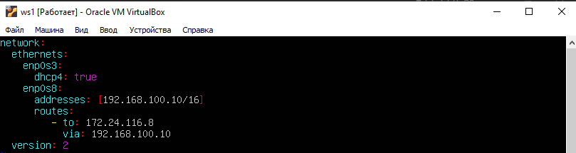

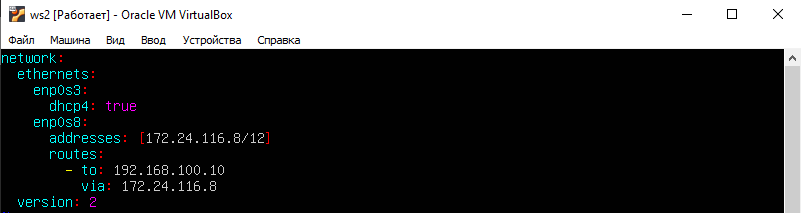

Для применения изменений необходимо выполнить команду `sudo netplan apply` для обеих машин.

- Пропинговать соединение между машинами. Результат приведен на рисунках ниже.


***
## 3. Утилита iperf3

### 3.1. Скорость соединения

- Для перевода скорости соединения из мегабит в секунду (Mbps) в мегабайт в секунду (MB/s) нужно учесть следующее:
1 Мегабит = 1/8 Мегабайта
Таким образом, чтобы перевести скорость из Mbps в MB/s, нужно разделить значение в Mbps на 8.
  - 8 Mbps = 1 MB/s;
- Для перевода скорости соединения из мегабайт в секунду (MB/s) в килобиты в секунду (Kbps) нужно учесть следующее:
1 Мегабайт = 8 Мегабит
Таким образом, чтобы перевести скорость из MB/s в Kbps, нужно умножить значение в MB/s на 8 и затем умножить на 1024 (поскольку в Kbps используется приставка "k", обозначающая тысячу).
  - 100 MB/s = 819 200 Kbps;
- Для перевода скорости соединения из гигабит в секунду (Gbps) в мегабит в секунду (Mbps) нужно учесть следующее:
1 Гигабит = 1024 Мегабит
Таким образом, чтобы перевести скорость из Gbps в Mbps, нужно умножить значение в Gbps на 1024.
  - 1 Gbps = 1024 Mbps.

### 3.2. Утилита iperf3

- Измерить скорость соединения между ws1 и ws2.
Для этого необходимо установить саму программу __iperf3__ на обеих машинах, для этого нужно выполнить команду `sudo apt install iperf3`. После этого нужно открыть порт (в данном случае 5201) для пакетов TCP, UDP в брандмауэре командами:
- `sudo firewall-cmd --permanent --add-port=5201/tcp`;
- `sudo firewall-cmd --permanent --add-port=5201/udp`;
- `sudo firewall-cmd --reload`.

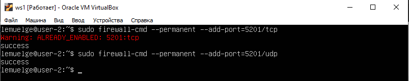

По окончании работы вышеупомянутых команд нужно запустить на сервере (пусть это будет ws1) команду `iperf3 -s`.
А на клиенте (пусть это будет ws2) нужно сделать запрос командой `iperf3 -c 192.168.100.10`. Ниже представлены выводы этих команд:


- 192.168.100.10 — адрес клиента;
- 172.24.116.8 — адрес сервера;
- ID — идентификатор запросов, нужен для ориентирования, если к серверу идет несколько обращений;
- Interval — промежуток времени в секундах, на протяжении которого выполнялась передача данных
- Transfer — сколько было передано данных за интервал времени;
- Bitrate — средняя скорость передачи данных за интервал времени;
- Retr — количество повторно отправленных TCP-сегментов;
- Cwnd — одновременно переданных данных.


***
## 4. Сетевой экран

### 4.1. Утилита iptables

- Создание файла __/etc/firewall.sh__, имитирующий фаерволл, на ws1 и ws2. 
- Содержимое вышеупомянутого файла после добавления правил приведено ниже.

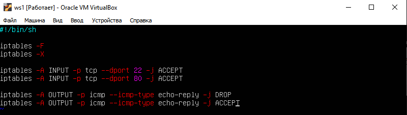

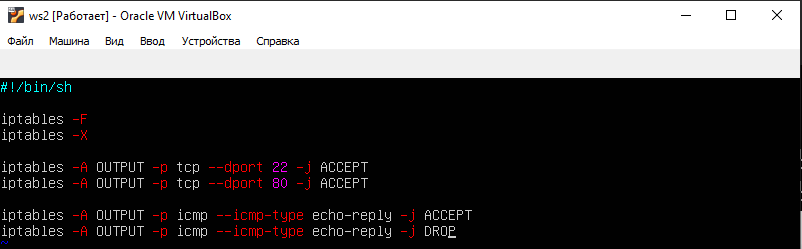

- Запуск файла на обеих машинах командами `chmod +x /etc/firewall.sh` и `/etc/firewall.sh`


Стратегия, примененная для машины ws1 запрещает пинг, т.к. в начале написано запрещающее правило, а в конце разрешающее, а стратегия машины ws2 наоборот разрешает пинг, т.к. в начале написано разрещающее правило, в конце - запрещающее.

### 4.2. Утилита nmap

- Командой `ping` найти машину, которая не "пингуется", после чего утилитой __nmap__ показать, что хост машины запущен


Как видно по рисунку машина ws1 с ip 192.168.100.10 не пингуется.


По рисунку видно, что хост машины ws1 запущен

- Для сохранения дампов образов виртуальных машин при закрытии нужно выбрать __Сохранить состояние машины__.

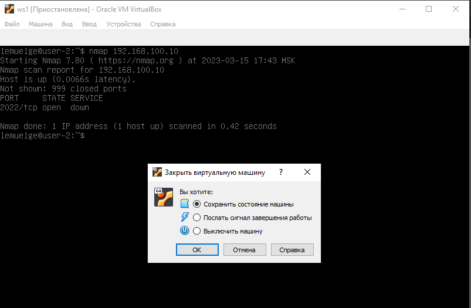

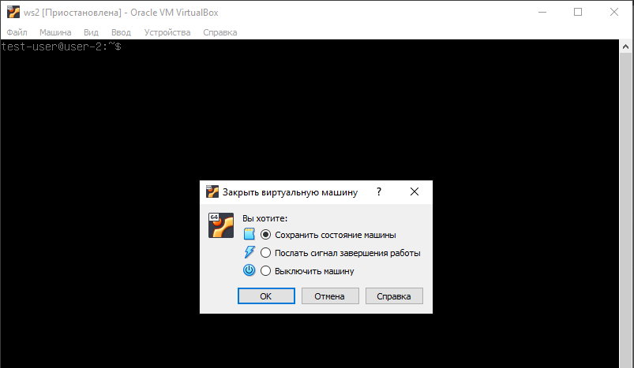


***
## 5. Статическая маршрутизация сети

### 5.1. Настройка адресов машин

- Перед включением ws11, ws22 и ws21 настроить сеть, а именно включить "Адаптер2" и выбрать тип подключения "Внутренняя сеть".
- Перед включением r1 и r2 настроить сеть, а именно включить "Адаптер2", "Адаптер3" и выбрать тип подключения Внутренняя сеть.
- Так же необходимо проверить, чтобы MAC-адреса на рабочих станциях и роутерах отличались друг от друга.
- Поднять пять виртуальных машин (3 рабочие станции (ws11, ws21, ws22) и 2 роутера (r1, r2)).
- Настроить конфигурации машин в "etc/netplan/00-installer-config.yaml" согласно сети, приведенной в задании.

На рисунках ниже приведены содержимые файла "etc/netplan/00-installer-config.yaml" для каждой машины и роутера.

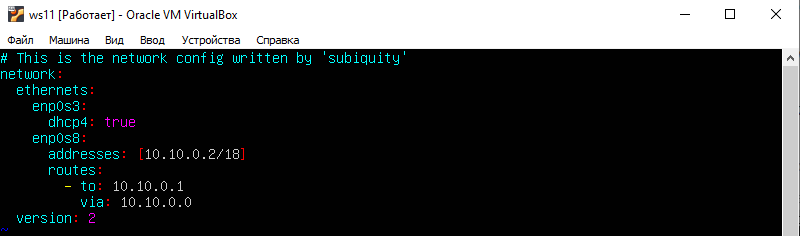

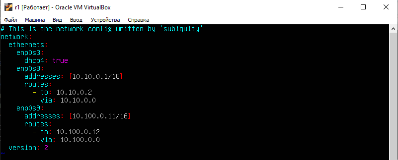


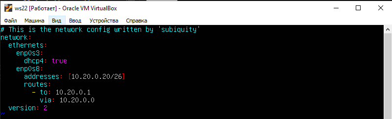

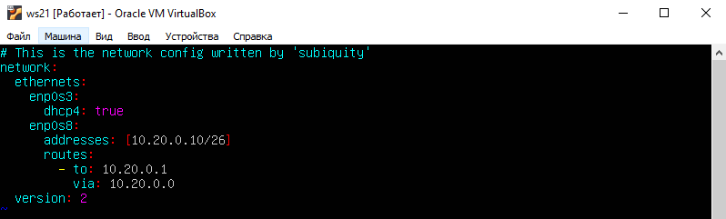

- Перезапустить сервис сети командой `sudo netplan apply`. Если ошибок нет, то командой `ip -4 a` проверить, что адрес машины задан верно. Также пропинговать ws22 с ws21. Аналогично пропинговать r1 с ws11.

Для применения изменений необходимо выполнить команду `sudo netplan apply`. Ниже приведены выводы данной команды для каждой машины и роутера.


Проверка введенных адресов можно проверить с помощью команды `ip -4 a`, т.е. "показать только IP-адреса версии 4 (IPv4)". Ниже приведены выводы данной команды.


Для того, чтобы пропинговать ws22 с ws21 необходимо выполнить на ws22 команду `ping 10.20.0.10 -c 5` или на ws21 команду `ping 10.20.0.20 -c 5`. Результаты выполнения данных команд приведены ниже на рис. 5.12


Аналогично можно пропинговать r1 с ws11, для этого нужно выполнить на r1 команду `ping 10.10.0.2 -c 5` или на ws11 команду `ping 10.10.0.1 -c 5`. Результаты выполнения данных команд приведены ниже на рис. 5.13


### 5.2. Включение переадресации IP-адресов

- Для включения переадресации IP, выполните команду на роутерах: `sysctl -w net.ipv4.ip_forward=1`

Вывод данной команды для роутеров приведен ниже.


- Откройте файл "/etc/sysctl.conf" и удалите символ "#" перед net.ipv4.ip_forward=1

Содержание файла "/etc/sysctl.conf" для обоих роутеров приведено ниже.

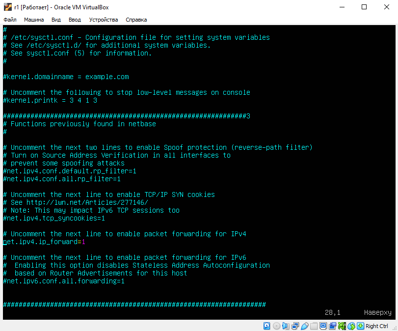

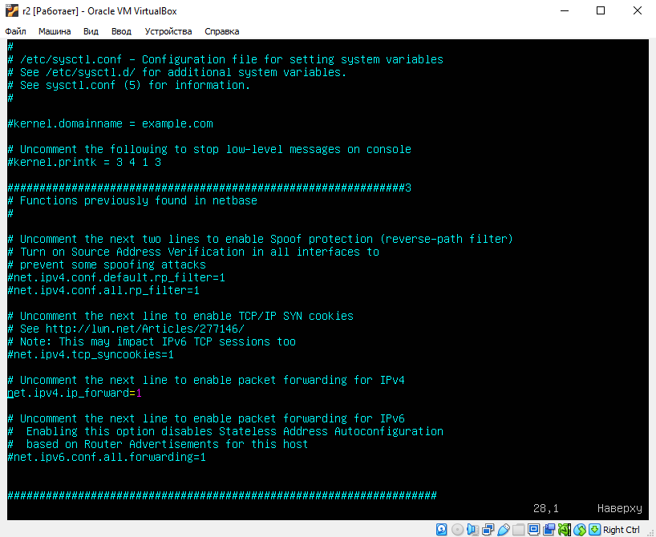

### 5.3. Установка маршрута по-умолчанию

- Для настройки маршрута по-умолчанию (шлюза) для рабочих станций нужно добавить строку "gateway4" в файле конфигураций. Ниже представлены содержимые данного файла каждой машины.

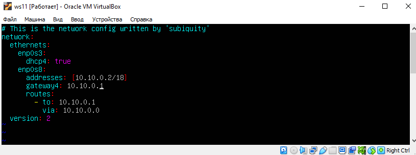

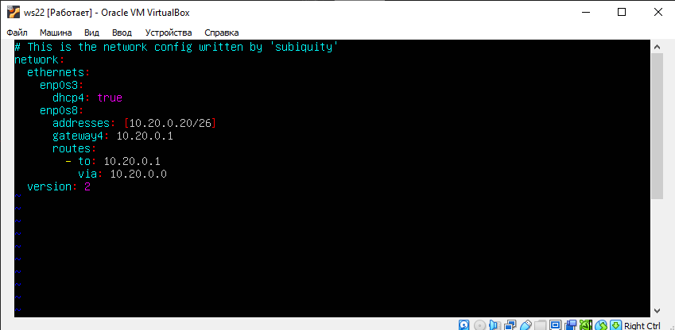

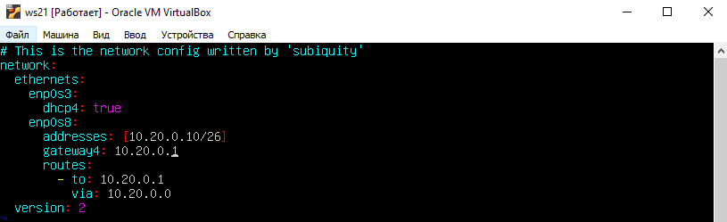

- Вызвать `ip r` и показать, что добавился маршрут в таблицу маршрутизации


- Пропинговать с ws11 роутер r2 и показать на r2, что пинг доходит. Для этого использовать команду: `tcpdump -tn -i eth1`


### 5.4. Добавление статических маршрутов

- Добавить в роутеры r1 и r2 статические маршруты в файле конфигураций.

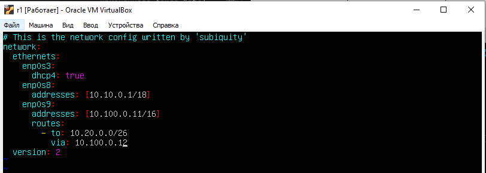

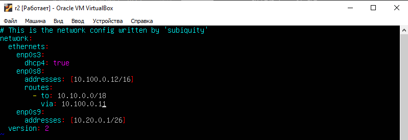

- Вызвать ip r и показать таблицы с маршрутами на обоих роутерах.


- Запустить команды на ws11: `ip r list 10.10.0.0/[маска сети]` и `ip r list 0.0.0.0/0`.

![Вывод команд `ip r list 10.10.0.0/[маска сети]` и `ip r list 0.0.0.0/0` на ws11](screenshots/Part5/part5_29.PNG)

Для адреса 10.10.0.0/18 был выбран маршрут, отличный от 0.0.0.0/0, хотя он попадает под маршрут по-умолчанию, т.к. данный маршрут будет использоваться только тогда, когда не будет подходящих маршрутов (он имеет более низкий приоритет).

### 5.5. Построение списка маршрутизаторов

- Запустить на r1 команду дампа: `tcpdump -tnv -i enp0s8`.
- При помощи утилиты traceroute построить список маршрутизаторов на пути от ws11 до ws21


- t - Не печатать временную метку в каждой строке дампа;
- n - Не конвертировать адреса (адреса узлов, номера портов и т. д.) в имена;
- v - Подробный вывод. Например, информация о времени жизни (TTL) и типе сервиса (ToS) в IP-пакете;
- i - Вывод информации, проходящую через определенный интерфейс;
- с - Указание количества пакетов, до которого нужно ввести захват.

> `traceroute` отправляет целевому узлу серию ICMP-пакетов (по умолчанию 3 пакета), с каждым шагом увеличивая значение поля TTL («время жизни») на 1. Это поле обычно указывает максимальное количество маршрутизаторов, которое может быть пройдено пакетом.
> Первая серия пакетов отправляется с TTL, равным 1, и поэтому первый же маршрутизатор возвращает обратно ICMP-сообщение «time exceeded in transit», указывающее на невозможность доставки данных. Traceroute фиксирует адрес маршрутизатора, а также время между отправкой пакета и получением ответа (эти сведения выводятся на монитор компьютера).
> Затем traceroute повторяет отправку серии пакетов, но уже с TTL, равным 2, что заставляет первый маршрутизатор уменьшить TTL пакетов на единицу и направить их ко второму маршрутизатору. Второй маршрутизатор, получив пакеты с TTL=1, так же возвращает «time exceeded in transit».
> Процесс повторяется до тех пор, пока пакет не достигнет целевого узла. При получении ответа от этого узла процесс трассировки считается завершённым.

### 5.6. Использование протокола ICMP при маршрутизации

- Запустить на r1 перехват сетевого трафика, проходящего через eth0 с помощью команды: `tcpdump -n -i enp0s8 icmp`


- Пропинговать с ws11 несуществующий IP (например, 10.30.0.111) с помощью команды: `ping -c 1 10.30.0.111`


***
## 6. Динамическая настройка IP с помощью DHCP

- Для r2 настроить в файле /etc/dhcp/dhcpd.conf конфигурацию службы DHCP:
  - Указать адрес маршрутизатора по-умолчанию, DNS-сервер и адрес внутренней сети.

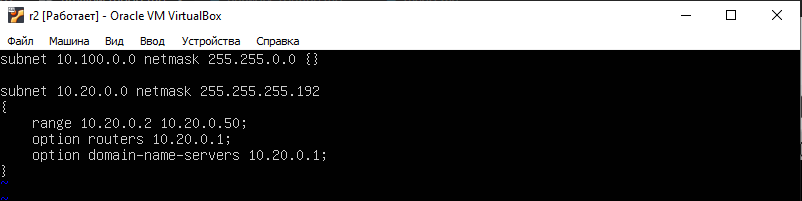

  - В файле resolv.conf прописать:

```bash
nameserver 8.8.8.8.
```

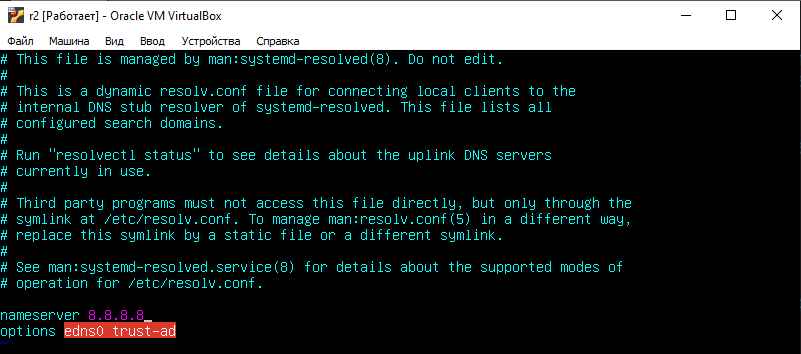

- Перезагрузить службу DHCP командой `systemctl restart isc-dhcp-server`. Машину ws21 перезагрузить при помощи `reboot` и через `ip a` показать, что она получила адрес. Также пропинговать ws22 с ws21.

Для динамической настройки IP с помощью DHCP неоходимо установить утилиту командой `sudo apt-get install isc-dhcp-server`.


Для того, чтобы машинами ws22 и ws21 принимались динамические IP адреса необходимо прописать в файле "/etc/netplan/00-installer-config.yaml" `dhcp4: true` и удалить статически заданный IP адрес.

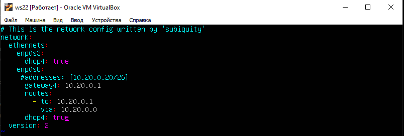

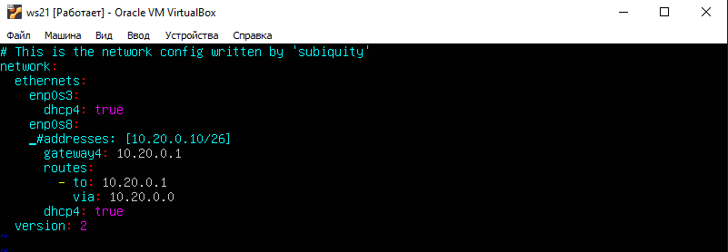

После этого необходимо применить изменения командой `sudo netplan apply` на обеих машинах.


- Указать MAC адрес у ws11, для этого в etc/netplan/00-installer-config.yaml надо добавить строки:

```bash
macaddress: 10:10:10:10:10:BA
dhcp4: true
```

Для того, чтобы сохранился MAC адрес необходимо прописать его в виртуальной машине, предварительно выключив ее.

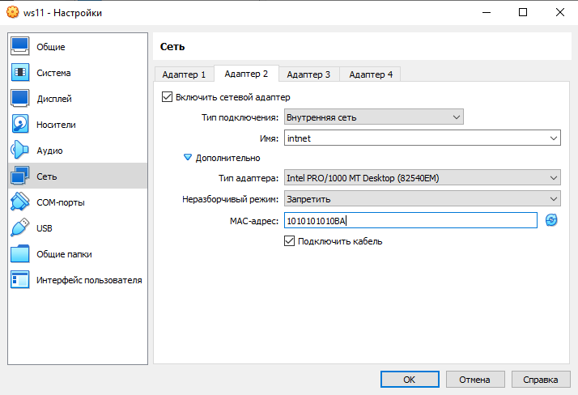

- Для r1 настроить аналогично r2, но сделать выдачу адресов с жесткой привязкой к MAC-адресу (ws11). Провести аналогичные тесты

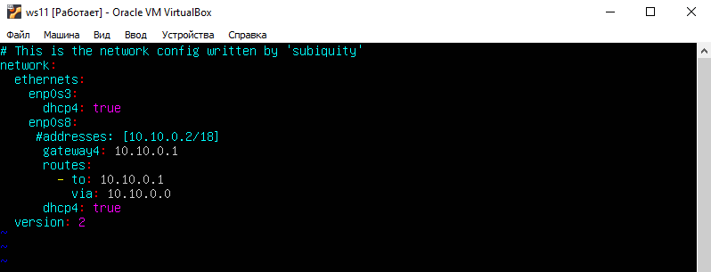

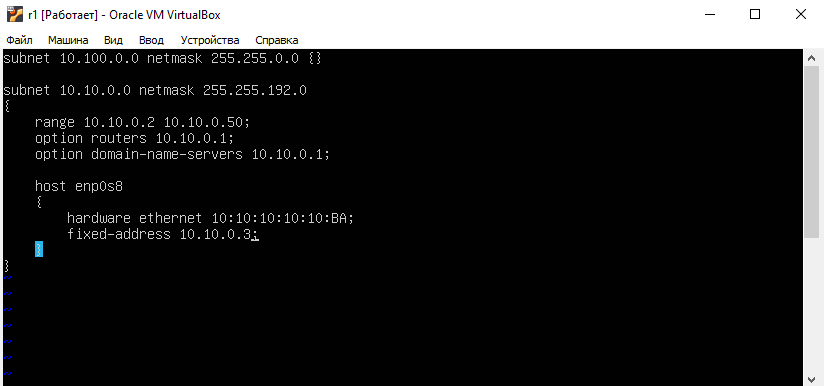


Об успешном результате проделанных операций можно убедиться проверив выданный IP адрес у ws11, а также пропинговав ее с роутером r1.


- Запросить с ws21 обновление ip адреса

Запрос обновления ip адреса осуществляется командой `sudo dhclient enp0s8`


В пункте 6 использовались адрес маршрутизатора по-умолчанию, DNS-сервер и адрес внутренней сети.

## 7. NAT

- В файле /etc/apache2/ports.conf на ws22 и r1 изменить строку `Listen 80` на `Listen 0.0.0.0:80`, то есть сделать сервер Apache2 общедоступным
Прежде всего нужно установить утилиту apache2 командой `sudo apt install apache2`.

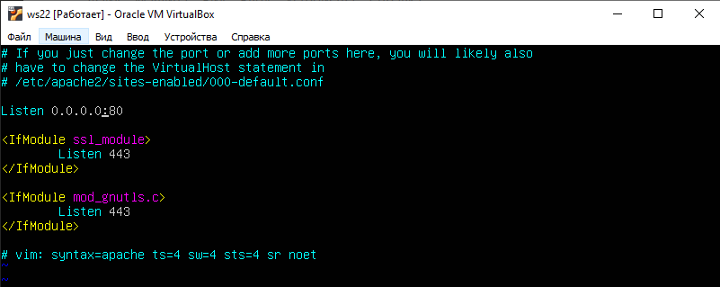

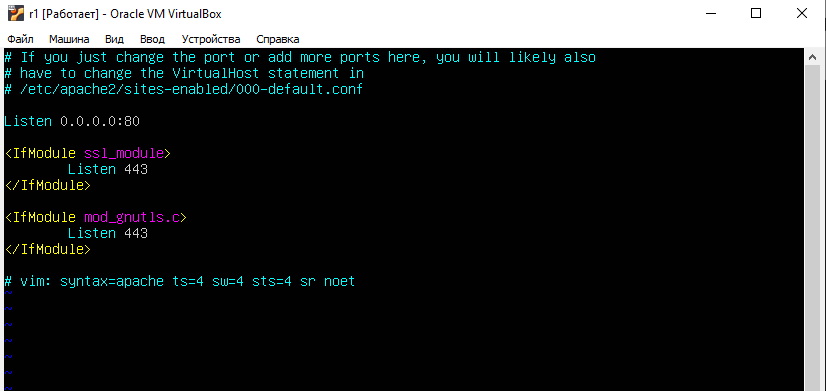

- Запустить веб-сервер Apache командой service apache2 start на ws22 и r1


- Добавить в фаервол, созданный по аналогии с фаерволом из Части 4, на r2 следующие правила:
1) Удаление правил в таблице filter - iptables -F.
2) Удаление правил в таблице "NAT" - iptables -F -t nat.
3) Отбрасывать все маршрутизируемые пакеты - iptables --policy FORWARD DROP.

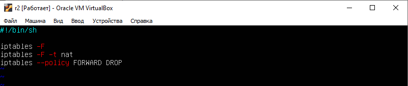

- Запускать файл также, как в Части 4.


- Проверить соединение между ws22 и r1 командой `ping`.


По рисунку видно, что ws22 с r1 не пингуется.

- Добавить в файл ещё одно правило:

4) Разрешить маршрутизацию всех пакетов протокола ICMP

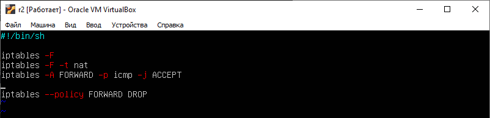

- Запускать файл также, как в Части 4.

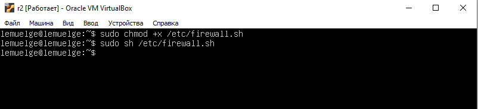

- Проверить соединение между ws22 и r1 командой ping.


По рисунку видно, что ws22 с r1 пингуется.

- Добавить в файл ещё два правила:

5) Включить SNAT, а именно маскирование всех локальных ip из локальной сети, находящейся за r2 (по обозначениям из Части 5 - сеть 10.20.0.0)

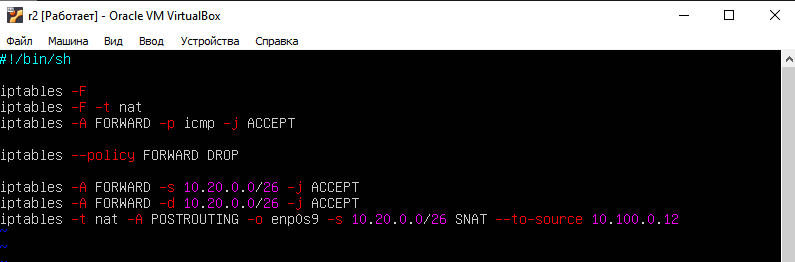

- Командой `iptables -A FORWARD -s 10.20.0.0/26 -j ACCEPT` разрешили прохождение пакетов между сетевыми интерфейсами
из локальной сети 10.20.0.0/26;
- Командой `iptables -A FORWARD -d 10.20.0.0/26 -j ACCEPT` разрешили прохождение пакетов между сетевыми интерфейсами
в локальную сеть 10.20.0.0/26;
- Командой `iptables -t nat -A POSTROUTING -o enp0s9 -s 10.20.0.0/26 -j SNAT --to-source 10.100.0.12` включили трансляцию адресов сети 10.20.0.0/26 на адрес 10.100.0.12.

6) Включить DNAT на 8080 порт машины r2 и добавить к веб-серверу Apache, запущенному на ws22, доступ извне сети

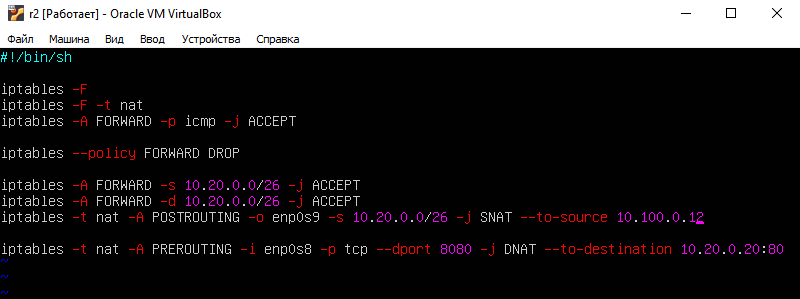

- Командой `iptables -t nat -A PREROUTING -i enp0s8 -p tcp --dport 8080 -j DNAT --to-destination 10.20.0.20:80` изменили адрес назначения всех пакетов пришедших на интерфейс enp0s8 по протоколу tcp с портом назначения TCP-сегмента 8080 на адрес внутреннего сервера 10.20.0.20 на порт 80.
- Запускать файл также, как в Части 4

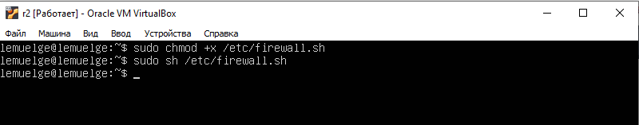

- Проверить соединение по TCP для SNAT, для этого с ws22 подключиться к серверу Apache на r1 командой: `telnet [адрес] [порт]`


- Проверить соединение по TCP для DNAT, для этого с r1 подключиться к серверу Apache на ws22 командой telnet (обращаться по адресу r2 и порту 8080)


***
## 8. Дополнительно. Знакомство с SSH Tunnels

- Запустить на r2 фаервол с правилами из Части 7
- Запустить веб-сервер Apache на ws22 только на localhost (то есть в файле /etc/apache2/ports.conf изменить строку `Listen 80` на `Listen localhost:80`)

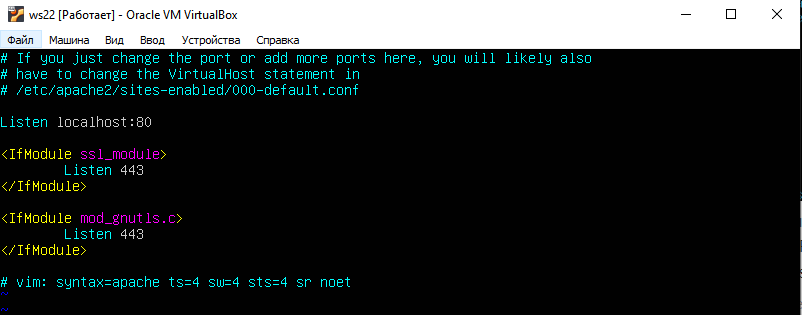

- Воспользоваться Local TCP forwarding с ws21 до ws22, чтобы получить доступ к веб-серверу на ws22 с ws21


- Воспользоваться Remote TCP forwarding c ws11 до ws22, чтобы получить доступ к веб-серверу на ws22 с ws11.


- Для проверки, сработало ли подключение в обоих предыдущих пунктах, перейдите во второй терминал (например, клавишами Alt + F2) и выполните команду: `telnet 127.0.0.1 [локальный порт]`


